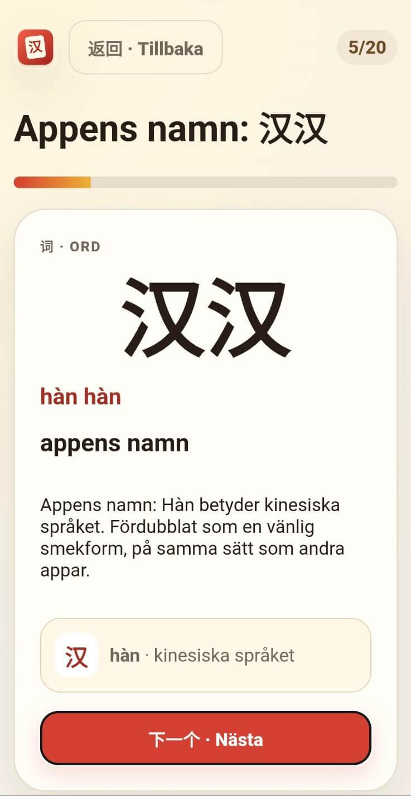

<p align="center">
  <a href="https://hanhan.viblo.se/">
    
  </a>
</p>

# HànHàn (汉汉)

HànHàn är en liten, statisk webbapplikation för svensktalande som vill lära sig grundläggande mandarin. Den körs direkt i webbläsaren och fungerar på både dator, mobil och surfplatta – utan installation. HànHàn lär ut förenklade kinesiska tecken, pinyin, vanliga ord och uttryck från sitt eget gränssnitt.

Gränssnittet blir gradvis mer kinesiskt i takt med att orden lärs in:

**svenska → kinesiska med svensk hjälp → endast kinesiska**

Framstegen sparas lokalt i webbläsaren. HànHàn kräver inget konto, har ingen backend och kan köras utan något byggsteg.

<p align="center">
  <a href="https://hanhan.viblo.se/"><strong>Öppna HànHàn</strong></a>
</p>

<p align="center">
  <a href="https://hanhan.viblo.se/">
    
  </a>
</p>

## Funktioner

- Svenska → förenklad kinesiska med pinyin
- Korta lektioner med tecken, ord och termer från appens gränssnitt
- Repetition med enkel intervallrepetition (SRS)
- Ett gränssnitt som gradvis övergår från svenska till kinesiska
- Lokal lagring av framsteg i webbläsaren
- Export och import av säkerhetskopior i JSON-format
- Anpassad för både dator, mobil och surfplatta
- Körs direkt i webbläsaren utan installation eller backend

## Data och integritet

HànHàn har inget konto och skickar inte dina framsteg till någon server. All studiedata lagras i `localStorage` i den aktuella webbläsaren.

Framstegen kan försvinna om du rensar webbplatsens data eller byter webbläsare eller enhet. Använd därför exportfunktionen i appens inställningar för att skapa en säkerhetskopia som senare kan importeras igen.

## Kör lokalt

Inget byggsteg behövs. Klona källkoden och servera katalogen statiskt, till exempel:

```bash
git clone https://github.com/vibloteket/hanhan.git
cd hanhan
python3 -m http.server 8000
```

Öppna sedan <http://localhost:8000/>.

## Tester

Kör testsviten:

```bash
npm test
```

Kontrollera JavaScript-syntaxen:

```bash
npm run check
```

## Teknik

HànHàn är en byggstegsfri, statisk SPA som använder Preact och htm. Webbläsarberoendena ingår i källkoden, så appen behöver varken backend, konto eller externa runtime-beroenden.

Mer information om produktens och gränssnittets principer finns i [DESIGN.md](DESIGN.md).

## Feedback, kontakt och källkod

Har du hittat ett fel eller har ett förbättringsförslag? [Öppna gärna ett ärende på GitHub](https://github.com/vibloteket/hanhan/issues). Du kan också kontakta mig via e-post på <vb@viblo.se>.

HànHàn är fri programvara med öppen källkod. [Källkoden finns på GitHub](https://github.com/vibloteket/hanhan) och licensieras under [AGPL-3.0-or-later](LICENSE.txt).
